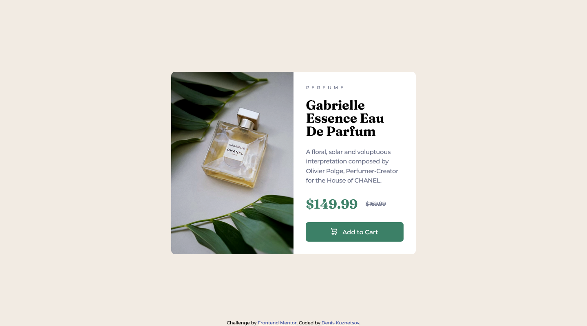

# Frontend Mentor - Product preview card component solution

This is a solution to the [Product preview card component challenge on Frontend Mentor](https://www.frontendmentor.io/challenges/product-preview-card-component-GO7UmttRfa). Frontend Mentor challenges help you improve your coding skills by building realistic projects. 

## Table of contents

- [Overview](#overview)
  - [The challenge](#the-challenge)
  - [Screenshot](#screenshot)
  - [Links](#links)
- [My process](#my-process)
  - [Built with](#built-with)
  - [What I learned](#what-i-learned)
  - [Continued development](#continued-development)
  - [Useful resources](#useful-resources)
- [Author](#author)
- [Acknowledgments](#acknowledgments)

**Note: Delete this note and update the table of contents based on what sections you keep.**

## Overview

### The challenge

Users should be able to:

- View the optimal layout depending on their device's screen size
- See hover and focus states for interactive elements

### Screenshot

### Links

- Solution URL: [https://github.com/DenKuznets/2.-product-preview-card-component-main]
- Live Site URL: [https://denkuznets.github.io/2.-product-preview-card-component-main]

## My process

### Built with

- HTML 
- CSS
- SASS
- PixelParallel by htmlBurger chrome extension for pixel perfect comparison
- CSS reset by https://piccalil.li/blog/a-modern-css-reset/

### What I learned

While doing this task, I found out that inset box-shadow doesn't work on an image. I had to add an image as a background and apply a box shadow on the element. May be there is a better way to handle it?

### Continued development

responsive design, sass, learn react and start using it in exercises

## Author

- Website - [Denis Kuznetsov](https://github.com/DenKuznets)
- Frontend Mentor - [@DenKuznets](https://www.frontendmentor.io/profile/DenKuznets)
- Instagram - [@denis_kyznecov](https://www.instagram.com/denis_kyznecov/)

## Acknowledgments

Thanks to the frontendmentor community for the helpful tips.
